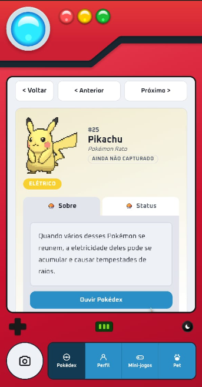

# V-Dex

<p align="center">
  
  
  
</p>

<p align="center">
  
  
  
  
</p>

> Pokédex web mobile-first. Aponte a câmera do celular para uma carta física de Pokémon e receba
> todas as informações do Pokémon identificado, com uma Pokédex que fala em voz alta, responde
> perguntas e ainda cuida de um pet virtual.

<p align="center">
  
</p>

##  Sumário

- [Funcionalidades](#funcionalidades)
- [Tecnologias](#tecnologias)
- [Pré-requisitos](#pré-requisitos)
- [Instalando e rodando](#instalando-e-rodando)
- [Fazendo o deploy (Vercel)](#fazendo-o-deploy-vercel)
- [Scripts disponíveis](#scripts-disponíveis)
- [Aviso sobre custos](#aviso-sobre-custos)
- [Autor](#autor)

##  Funcionalidades

- **Escaneamento de cartas**: tira uma foto de uma carta física e identifica o Pokémon via Google
  Gemini (visão computacional), buscando os dados na PokeAPI e traduzindo automaticamente.
- **Voz da Pokédex**: ouça a descrição de qualquer Pokémon, com onboarding narrado.
- **Pergunte à Pokédex**: pergunte qualquer coisa sobre um Pokémon, por texto ou áudio, e receba
  uma resposta falada.
- **Coleção pessoal**: histórico de capturas por usuário, perfil de treinador, Pokémon favorito.
- **Mini-jogos**: Quem é esse Pokémon?, Jogo da Memória, Quiz da Pokédex.
- **Pet virtual**: cuide do seu Pokémon favorito como um Tamagotchi (fome, felicidade, energia,
  nível).

Todo o projeto roda com serviços de tier gratuito. Veja abaixo como configurar cada um.

##  Tecnologias

- **Frontend e Backend**: Next.js (App Router)
- **Banco de dados**: MongoDB (via Mongoose)
- **Dados de Pokémon**: [PokeAPI](https://pokeapi.co) (pública, sem chave)
- **Reconhecimento de carta e tradução**: [Google Gemini](https://ai.google.dev)
- **Voz da Pokédex**: [Fish Audio](https://fish.audio) (opcional, com fallback pro Gemini)
- **Autenticação**: [Auth.js](https://authjs.dev) (login e senha próprios)

##  Pré-requisitos

> Este guia foi escrito pensando em qualquer nível de experiência. Se você nunca configurou uma
> variável de ambiente ou nunca fez deploy de um projeto antes, não se preocupe: cada passo abaixo
> explica exatamente onde clicar.

Antes de começar, verifique se você tem:

- [Node.js](https://nodejs.org) 20 ou mais recente instalado
- Uma conta gratuita em cada um destes serviços (o passo a passo de cada um está na próxima
  seção): [MongoDB Atlas](https://www.mongodb.com/cloud/atlas/register) e
  [Google AI Studio](https://aistudio.google.com/apikey)

##  Instalando e rodando

### 1. Clone e instale as dependências

```bash
git clone https://github.com/BrenoMendonca/v-dex.git
cd v-dex
npm install
```

### 2. Configure as variáveis de ambiente

> **O que é isso?** Um arquivo `.env` guarda configurações e chaves secretas (senhas, tokens de
> API) fora do código. Em vez de escrever uma chave direto num arquivo `.js`, o código lê o valor
> de `process.env.NOME_DA_VARIAVEL`, e cada pessoa que roda o projeto preenche seu próprio arquivo
> local com as próprias chaves. Por isso o `.env.local` nunca é enviado pro GitHub (ele está no
> `.gitignore`): cada chave é pessoal e não deve ser compartilhada. O `.env.example`, por outro
> lado, é só um modelo com os nomes das variáveis vazios, pra você saber quais precisa preencher.

Copie o arquivo de exemplo:

```bash
cp .env.example .env.local
```

Depois preencha cada variável seguindo o passo a passo abaixo. Nunca commite o `.env.local`.

Estas são as variáveis usadas neste projeto especificamente:

| Variável | Obrigatória? | Pra que serve |
|---|---|---|
| `MONGODB_URI` | Sim | Endereço de conexão com o banco MongoDB, onde ficam usuários, capturas, cache de Pokémon e tudo mais. |
| `GEMINI_API_KEY` | Sim | Chave do Google Gemini, usada pra identificar o Pokémon na foto da carta e traduzir os textos da Pokédex. |
| `AUTH_SECRET` | Sim | Segredo usado pelo Auth.js pra assinar a sessão de login. Não vem de nenhum site, você mesmo gera. |
| `FISH_AUDIO_API_KEY` | Não | Chave da Fish Audio, dá uma voz mais natural à Pokédex. Sem ela, o app usa a voz do Gemini. |
| `FISH_AUDIO_VOICE_ID` | Não | Qual voz da Fish Audio usar. Só faz sentido junto com a chave acima. |
| `ADMIN_SEED_SECRET` | Não | Protege a rota `/api/admin/seed-dex`, que pré-carrega a Pokédex inteira em lote. |
| `ALLOWED_DEV_ORIGIN` | Não | Libera acesso ao `npm run dev` a partir de outro aparelho na sua rede local (ex: testar no celular). |

O passo a passo pra conseguir cada uma está logo abaixo.

<details>
<summary><code>MONGODB_URI</code> (obrigatória)</summary>

1. Crie uma conta gratuita em [MongoDB Atlas](https://www.mongodb.com/cloud/atlas/register).
2. Crie um cluster do tier gratuito (M0).
3. Em **Database Access**, crie um usuário de banco com login e senha.
4. Em **Network Access**, libere seu IP (ou `0.0.0.0/0` pra facilitar em desenvolvimento).
5. Clique em **Connect**, depois **Drivers**, copie a connection string e troque `<password>` pela
   senha do usuário criado.

</details>

<details>
<summary><code>GEMINI_API_KEY</code> (obrigatória)</summary>

1. Acesse [Google AI Studio](https://aistudio.google.com/apikey) e faça login com uma conta Google.
2. Clique em **Create API key**.
3. Copie a chave gerada. O tier gratuito não exige cartão de crédito.

</details>

<details>
<summary><code>AUTH_SECRET</code> (obrigatória)</summary>

Não vem de nenhum site. É um segredo gerado localmente, usado pra assinar as sessões de login:

```bash
npx auth secret
# ou
openssl rand -base64 32
```

</details>

<details>
<summary><code>FISH_AUDIO_API_KEY</code> e <code>FISH_AUDIO_VOICE_ID</code> (opcionais)</summary>

Dão à Pokédex uma voz mais natural. Sem essas duas variáveis, o app usa automaticamente a voz do
Gemini como alternativa; a aplicação funciona igual, só muda a voz.

1. Crie uma conta em [fish.audio](https://fish.audio).
2. Gere uma API key nas configurações da conta (`FISH_AUDIO_API_KEY`).
3. Escolha uma voz na biblioteca pública do site (ou clone a sua própria) e copie o ID de
   referência dela (`FISH_AUDIO_VOICE_ID`).

O tier gratuito do Fish Audio é promocional e pode expirar a qualquer momento sem aviso. Por isso
o fallback automático pro Gemini existe.

</details>

<details>
<summary><code>ADMIN_SEED_SECRET</code> (opcional)</summary>

Só necessária se você quiser usar `POST /api/admin/seed-dex`, que pré-carrega e traduz a Pokédex
inteira em lote (deixa a navegação instantânea depois). Pode ser qualquer string à sua escolha,
enviada no header `x-admin-secret`.

</details>

<details>
<summary><code>ALLOWED_DEV_ORIGIN</code> (opcional)</summary>

Só necessária se você quiser testar em outro aparelho na mesma rede local durante o
desenvolvimento (ex: abrir o app no celular apontando pro IP do seu computador). Coloque esse IP
aqui. Sem essa variável, `npm run dev` funciona normalmente em `localhost`.

</details>

### 3. Rode o servidor de desenvolvimento

```bash
npm run dev
```

Abra [http://localhost:3000](http://localhost:3000).

##  Fazendo o deploy (Vercel)

Depois de rodar localmente, dá pra colocar sua própria versão no ar de graça usando a
[Vercel](https://vercel.com) (a empresa por trás do Next.js). Não é preciso saber nada de servidor
pra isso, o passo a passo abaixo cobre tudo.

### Deploy em um clique

[](https://vercel.com/new/clone?repository-url=https://github.com/BrenoMendonca/v-dex&env=MONGODB_URI,GEMINI_API_KEY,AUTH_SECRET&envDescription=Veja%20como%20conseguir%20cada%20chave%20na%20se%C3%A7%C3%A3o%20%22Instalando%20e%20rodando%22%20do%20README&envLink=https://github.com/BrenoMendonca/v-dex%23instalando-e-rodando)

Clique no botão, entre com sua conta do GitHub e preencha as variáveis obrigatórias quando a
Vercel pedir. São as mesmas que você já configurou no `.env.local` (veja o passo a passo na seção
anterior).

### Passo a passo manual

1. Suba seu próprio fork ou cópia deste repositório pro seu GitHub.
2. Acesse [vercel.com](https://vercel.com) e crie uma conta gratuita (dá pra entrar direto com o
   GitHub, sem precisar de cartão de crédito).
3. Clique em **Add New**, depois **Project**, e selecione o repositório.
4. Na tela de configuração, abra **Environment Variables** e adicione cada variável do seu
   `.env.local`, uma por vez (nome e valor).
5. Clique em **Deploy** e espere o build terminar. Ao final, a Vercel te dá um link público pra
   acessar o app.

### Dois detalhes que costumam pegar quem está fazendo o primeiro deploy

- **Libere o acesso do MongoDB Atlas pra qualquer IP.** A Vercel não usa um IP fixo (cada
  requisição pode sair de um servidor diferente), então em **Network Access** no Atlas a opção
  `0.0.0.0/0` (permitir de qualquer lugar) precisa estar ativa. Sem isso, o app conecta certinho no
  seu computador mas não consegue falar com o banco em produção.
- **Mudou uma variável de ambiente depois do primeiro deploy? Force um novo deploy.** A Vercel não
  atualiza sozinha os servidores que já estão no ar. Vá em **Deployments**, escolha o último deploy
  e clique em **Redeploy**, senão algumas requisições continuam usando o valor antigo por um tempo.

##  Scripts disponíveis

```bash
npm run dev       # ambiente de desenvolvimento
npm run build     # build de produção
npm run start     # roda o build de produção
npm run lint      # lint do projeto
```

##  Aviso sobre custos

Todas as integrações usadas aqui têm tier gratuito, e o projeto foi desenhado pra caber
confortavelmente dentro deles (cache agressivo no MongoDB, rate limiting no scan de cartas e no
cadastro). Ainda assim, se você expuser sua própria instância publicamente, é uma boa prática
adicionar autenticação ou rate limiting extra nas rotas de API antes de divulgar o link, pra evitar
que outra pessoa consuma sua cota gratuita.

##  Autor

<p align="left">
  
</p>

Feito por **Breno Mendonça**.

[](https://www.linkedin.com/in/breno-mendon%C3%A7a-305338143/)

---
